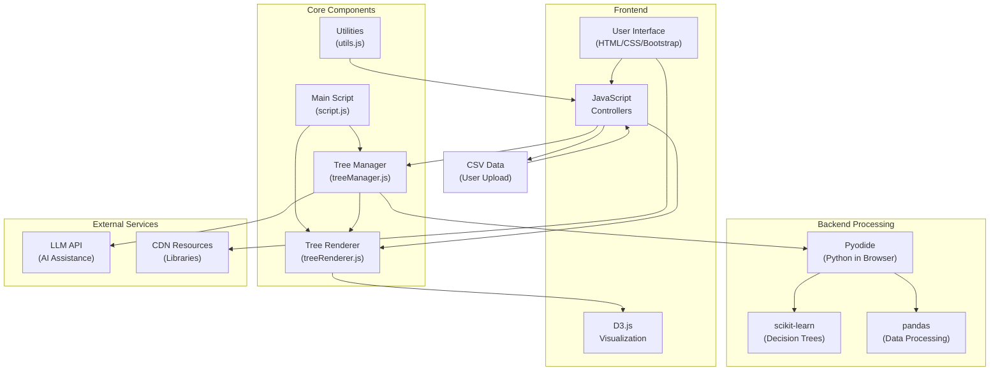

# Decision Tree Builder

An interactive web application for building, visualizing, and modifying decision trees with AI assistance. This tool combines machine learning capabilities with an intuitive interface to help users create, understand, and refine decision trees for data analysis and prediction tasks.

## Key Features

- **Data Integration**
  - Upload and analyze CSV datasets
  - Automatic feature detection and preprocessing
  - Support for categorical and numerical data

- **AI-Powered Assistance**
  - Natural language chat interface for tree modifications
  - Intelligent feature derivation from raw data
  - Contextual explanations of decision nodes and tree structure
  - Performance analysis and improvement suggestions

- **Advanced Visualization**
  - Interactive D3.js-based tree visualization
  - Expandable/collapsible nodes for easy navigation
  - Visual indicators for decision thresholds and leaf nodes
  - Tooltips with contextual information

- **Tree Manipulation**
  - Dynamic node reordering to adjust feature importance
  - Pruning controls for complexity management
  - Cutoff threshold adjustments via chat interface
  - Custom depth limitations for individual branches

- **Performance Metrics**
  - Real-time accuracy tracking
  - Precision, recall, and F1 score calculations
  - Comparative metrics between tree iterations
  - Visual performance indicators

## Getting Started

### Prerequisites
- A modern web browser (Chrome, Firefox, Edge, Safari)
- Internet connection (required for CDN resources and AI functionality)

### Installation

1. Clone the repository:
   ```
   git clone https://github.com/prudhvi1709/dtgen.git
   ```

2. Open `index.html` in your web browser
   - No additional setup required - all dependencies are loaded from CDN

## How to Use

1. **Data Import**
   - Upload your CSV dataset using the file input
   - The application will automatically detect columns and data types

2. **Initial Configuration**
   - Select your target prediction column
   - Click "Generate Decision Tree" to create the initial model

3. **Tree Interaction**
   - Explore the tree by expanding/collapsing nodes
   - Click "Explain Tree" to get AI-powered insights
   - Select different performance metrics to evaluate the model

4. **AI Collaboration**
   - Click "Chat with AI" to open the chat interface
   - Use natural language to request:
     - New derived columns based on domain knowledge
     - Tree structure modifications
     - Pruning specific branches
     - Adjusting decision thresholds
     - Reordering nodes for different feature priorities

5. **Refinement**
   - Compare metrics between iterations
   - Fine-tune the tree based on AI suggestions
   - Export or share your optimized model

## Technical Details

### Architecture
The application uses a client-side architecture that combines:
- JavaScript for UI interactions and tree management
- Python (via Pyodide WebAssembly) for machine learning computation
- D3.js for interactive tree visualization
- LLM API for AI assistance and explanations



### Application Flow
1. User uploads CSV data through the interface
2. Data is processed in-browser using Pyodide and pandas
3. Tree Manager builds the decision tree using scikit-learn
4. Tree Renderer visualizes the tree using D3.js
5. User interacts with the tree via UI or chat interface
6. AI assistance provided through LLM API calls
7. Tree updates are processed and reflected in real-time

### Dependencies

- **Frontend**
  - Bootstrap 5.3.0 (UI components and styling)
  - D3.js v7 (Tree visualization)
  
- **Machine Learning**
  - Pyodide v0.24.1 (Python in browser)
  - scikit-learn (Decision tree algorithms)
  - pandas (Data processing)

## API Configuration

To use the AI features, you need to:
1. Replace `YOUR_API_KEY` in `app.js` with your actual API key / login to [LLM Foundry](https://llmfoundry.straive.com/)
2. Ensure you have access to the LLM service at `https://llmfoundry.straive.com/openai/v1/chat/completions`

## Roadmap

- [ ] Export functionality for trees and derived data
- [ ] Performance optimizations for large datasets

## License

This project is licensed under the MIT License - see the [LICENSE](LICENSE) file for details. 